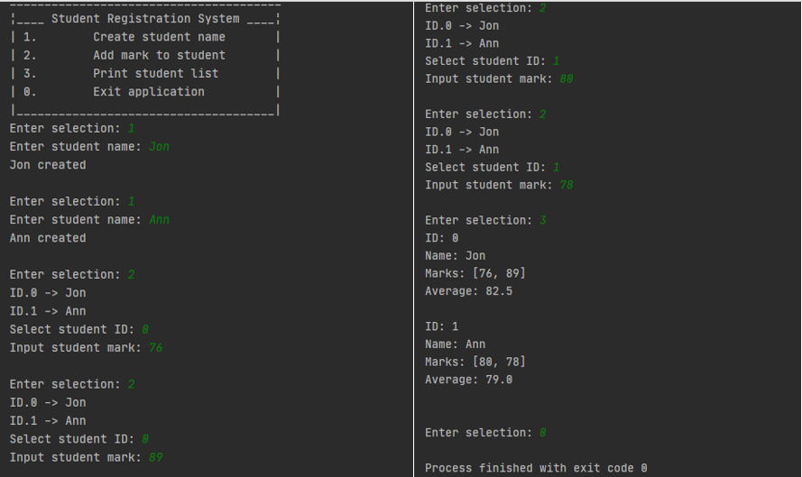

### Requirements
---
- [x] Create a new student record in the format {'name': 'student_name', 'marks': []}
- [x] Assign marks to the student
- [x] Calculate average mark
---

##### Built using:
* Random Module
* Functions
* Set comprehension
* While loop
* Split()

*Screenshot:* 
